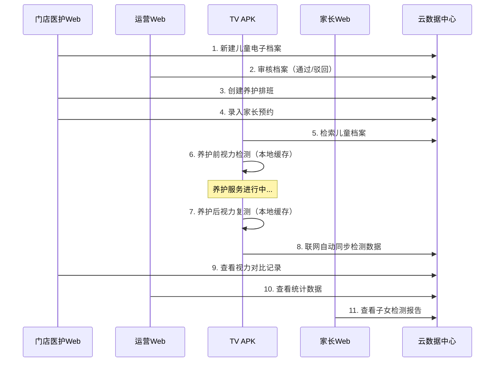
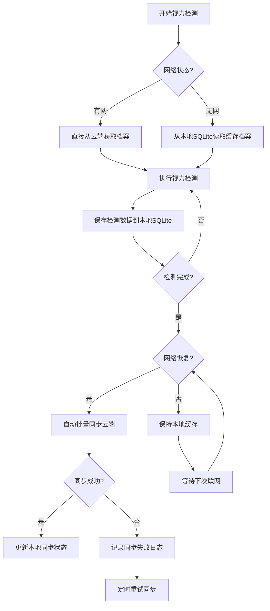

# 第一阶段：需求梳理与业务建模

## 1.1 项目背景

### 业务痛点

Careld可尔欧得线下视力养护门店目前面临以下问题：

1. **档案管理混乱** - 儿童视力档案分散在各门店，纸质记录易丢失
2. **预约效率低** - 电话预约易冲突，排班不透明
3. **检测数据孤岛** - 视力检测数据无法统一管理分析
4. **家长参与度低** - 家长无法实时查看子女视力变化
5. **运营决策缺乏数据支撑** - 总部无法掌握全国门店经营情况

### 项目目标

建立统一的云管理系统，实现：
- ✅ 儿童视力电子档案全生命周期管理
- ✅ 养护预约线上化、排班智能化
- ✅ TV端电子视力表标准化测量
- ✅ 多终端数据实时互通
- ✅ 数据驱动运营决策

---

## 1.2 终端构成（四端）

| 终端 | 技术形态 | 使用场景 | 核心用户 |
|------|---------|---------|---------|
| **运营中心Web端** | Vue3 SPA | 总部管理后台 | 总部运营管理员 |
| **门店医院Web端** | Vue3 SPA | 门店电脑管理 | 门店医护人员 |
| **家长Web端** | Vue3 SPA (响应式) | 手机/PC浏览器 | 家长用户 |
| **安卓TV电视端** | Android APK | 门店智能电视 | TV设备终端 |

### 终端技术规格

#### 运营中心Web端
- **分辨率**：1920×1080 及以上
- **浏览器**：Chrome 90+, Edge 90+, Firefox 88+
- **功能定位**：全局管理、数据看板、系统配置

#### 门店医院Web端
- **分辨率**：1920×1080 及以上
- **浏览器**：Chrome 90+, Edge 90+
- **功能定位**：门店业务操作、档案管理、预约排班

#### 家长Web端
- **分辨率**：自适应（320px - 1920px）
- **浏览器**：微信内置浏览器、Chrome、Safari
- **功能定位**：档案查询、报告查看、预约查看

#### 安卓TV电视端
- **系统版本**：Android 7.0 (API 24) 及以上
- **屏幕尺寸**：43寸 - 75寸电视
- **分辨率**：1080P / 4K
- **输入方式**：遥控器（主要）、触控（辅助）
- **网络**：WiFi / 4G LTE
- **功能定位**：电子视力表、离线检测、数据同步

---

## 1.3 角色权限建模

### 1.3.1 角色定义

| 角色 | 使用终端 | 核心权限 | 数量预估 |
|------|---------|---------|---------|
| **总部运营管理员** | 运营中心Web | 门店管理、全量档案审核、全门店排班查看、数据分析、系统配置 | 5-10人 |
| **门店医护人员** | 门店Web + TV APK | 儿童建档、养护预约、门店排班、TV视力检测、本店记录查询导出 | 每店2-5人 |
| **家长用户** | 家长Web | 子女视力档案、历史养护/检测记录查看 | 按儿童数量 |
| **TV设备终端** | TV APK | 视力测量、离线缓存、数据同步、调取本店儿童档案 | 每店1-3台 |

### 1.3.2 权限矩阵

#### 功能权限矩阵

| 功能模块 | 总部运营 | 门店医护 | 家长 | TV设备 |
|---------|---------|---------|------|--------|
| **门店管理** | 增删改查 | 仅查看本店 | - | - |
| **档案管理** | 审核、查看全部 | 新建、编辑、查看本店 | 查看子女 | 检索本店 |
| **预约排班** | 查看全部 | 管理本店 | 查看子女预约 | - |
| **视力检测** | 查看全部记录 | 查看本店记录 | 查看子女记录 | 执行检测 |
| **数据统计** | 全国数据 | 本店数据 | 子女数据 | - |
| **系统配置** | 全部权限 | - | - | - |
| **TV设备管理** | 绑定/解绑 | 查看本店设备 | - | - |

#### 数据权限规则

```
数据隔离原则：
1. 总部运营 - 可查看全国所有门店数据
2. 门店医护 - 仅可查看本门店数据
3. 家长用户 - 仅可查看绑定子女数据
4. TV设备   - 仅可访问绑定门店的儿童档案
```

---

## 1.4 核心业务流程建模

### 流程1：建档-预约-养护-视力检测完整链路



#### 流程步骤详解

**步骤1：门店建档**
- 门店医护在Web端录入儿童基本信息
- 上传眼部病史、既往视力记录
- 提交后档案状态为"待审核"

**步骤2：运营审核**
- 总部运营在后台查看待审核档案列表
- 审核通过：档案状态变为"已通过"
- 审核驳回：填写驳回原因，退回门店修改

**步骤3：创建排班**
- 门店创建养护技师排班（日期+时段）
- 配置各时段可预约人数

**步骤4：录入预约**
- 门店录入家长预约信息
- 或家长通过家长端自助预约（如开放）
- 预约状态：待到店/已到店/已完成/已取消

**步骤5：TV检索档案**
- 门店医护在TV端输入儿童姓名/手机号
- TV从云端获取儿童档案（或本地缓存）

**步骤6-7：视力检测**
- TV端显示标准对数视力表
- 分左右眼分别测量
- 自动记录视力数值（如4.8、5.0）
- 数据先存入本地SQLite

**步骤8：数据同步**
- TV检测网络状态
- 联网时自动批量上传未同步数据
- 云端返回同步结果

**步骤9-11：多端查看**
- 门店Web：查看本次养护前后对比
- 运营Web：查看全国统计数据
- 家长Web：查看子女检测报告

### 流程2：离线断网兼容流程



#### 离线机制详解

**本地存储结构（TV端SQLite）**
```sql
-- 本地儿童简档（仅本店）
local_child_profile: id, child_id, name, phone, birth_date, sync_time

-- 本地未同步视力记录
local_vision_record: id, child_id, eye_type, vision_level, 
                     test_time, before_after, sync_status, retry_count

-- 本地同步日志
local_sync_log: id, sync_time, record_count, success_count, 
                fail_count, error_msg
```

**同步策略**
1. **触发时机**：开机时、检测完成后、网络恢复时、手动触发
2. **同步方式**：增量同步，仅上传未同步数据
3. **冲突处理**：以TV端时间戳为准，云端去重
4. **失败重试**：指数退避重试（1min → 5min → 15min → 1h）
5. **数据保留**：本地保留最近90天数据

---

## 1.5 功能模块拆解（全端）

### 1.5.1 运营中心Web模块

#### 模块1：医院门店管理

| 功能点 | 描述 | 优先级 |
|--------|------|--------|
| 门店新增 | 录入门店编码、名称、地址、联系方式 | P0 |
| 门店编辑 | 修改门店信息、状态（启用/禁用） | P0 |
| 门店查询 | 按名称/编码/地区筛选 | P0 |
| 账号分配 | 为门店创建医护账号 | P0 |
| 网络配置 | 配置门店4G设备接入信息 | P1 |
| TV设备绑定 | 查看/解绑门店TV设备 | P0 |

#### 模块2：电子档案审核

| 功能点 | 描述 | 优先级 |
|--------|------|--------|
| 待审核列表 | 全国门店待审核档案 | P0 |
| 档案详情 | 查看儿童完整档案信息 | P0 |
| 审核通过 | 一键通过，档案生效 | P0 |
| 审核驳回 | 填写驳回原因，退回修改 | P0 |
| 已审核查询 | 按状态/门店/时间筛选 | P0 |

#### 模块3：排班总览

| 功能点 | 描述 | 优先级 |
|--------|------|--------|
| 全门店排班日历 | 查看全国门店排班情况 | P0 |
| 异常预约标记 | 标记超预约/冲突排班 | P1 |
| 预约干预 | 强制调整/取消预约 | P1 |

#### 模块4：数据分析模块

| 功能点 | 描述 | 优先级 |
|--------|------|--------|
| 门店客流统计 | 按日/周/月统计到店人数 | P0 |
| 视力改善统计 | 养护前后视力对比分析 | P0 |
| 养护频次报表 | 儿童养护次数分布 | P1 |
| 数据导出 | Excel/PDF导出 | P0 |
| 数据可视化 | 折线图、柱状图、饼图 | P0 |

#### 模块5：系统配置

| 功能点 | 描述 | 优先级 |
|--------|------|--------|
| 账号权限管理 | 运营账号增删改查 | P0 |
| 电子视力表参数 | 视标大小、行数、间距配置 | P1 |
| 数据备份策略 | 自动备份时间、保留周期 | P1 |
| 同步规则配置 | TV同步频率、重试策略 | P1 |

### 1.5.2 门店Web模块

#### 模块1：儿童电子档案管理

| 功能点 | 描述 | 优先级 |
|--------|------|--------|
| 新建档案 | 录入儿童基本信息、病史 | P0 |
| 编辑档案 | 修改未审核/被驳回的档案 | P0 |
| 档案详情 | 查看完整档案信息 | P0 |
| 提交审核 | 提交档案至总部审核 | P0 |
| 本店档案列表 | 按状态/姓名/手机号筛选 | P0 |

#### 模块2：养护预约管理

| 功能点 | 描述 | 优先级 |
|--------|------|--------|
| 新增预约 | 为儿童预约养护时段 | P0 |
| 修改预约 | 更改预约时间/技师 | P0 |
| 取消预约 | 取消预约，释放时段 | P0 |
| 预约提醒 | 发送预约提醒（短信/微信） | P1 |
| 预约列表 | 按日期/状态筛选 | P0 |

#### 模块3：养护排班管理

| 功能点 | 描述 | 优先级 |
|--------|------|--------|
| 技师管理 | 本店技师增删改查 | P0 |
| 时段配置 | 设置可预约时段（如9:00-18:00） | P0 |
| 排班日历 | 可视化排班日历 | P0 |
| 批量排班 | 按周/月批量创建排班 | P1 |

#### 模块4：记录查询

| 功能点 | 描述 | 优先级 |
|--------|------|--------|
| 视力记录列表 | 本店儿童全周期视力记录 | P0 |
| 养护记录列表 | 本店养护服务记录 | P0 |
| 视力对比 | 养护前后视力对比展示 | P0 |
| Excel导出 | 导出查询结果 | P0 |

#### 模块5：TV设备绑定

| 功能点 | 描述 | 优先级 |
|--------|------|--------|
| 设备码绑定 | 输入TV设备码绑定门店 | P0 |
| 设备列表 | 查看本店已绑定设备 | P0 |
| 设备解绑 | 解绑不再使用的设备 | P0 |
| 设备状态 | 查看设备在线/离线状态 | P1 |

### 1.5.3 家长Web模块

#### 模块1：子女基础档案查看

| 功能点 | 描述 | 优先级 |
|--------|------|--------|
| 档案绑定 | 通过手机号/验证码绑定子女 | P0 |
| 档案详情 | 查看子女基本信息、病史 | P0 |
| 多子女切换 | 多个子女的档案切换 | P1 |

#### 模块2：历次视力检测报告

| 功能点 | 描述 | 优先级 |
|--------|------|--------|
| 报告列表 | 按时间倒序展示检测报告 | P0 |
| 报告详情 | 单次检测详细数据 | P0 |
| 养护前后对比 | 同次养护前后视力对比 | P0 |

#### 模块3：历史养护记录

| 功能点 | 描述 | 优先级 |
|--------|------|--------|
| 养护记录列表 | 历次养护时间、门店、技师 | P0 |
| 预约记录 | 历史预约记录 | P0 |

#### 模块4：视力变化趋势

| 功能点 | 描述 | 优先级 |
|--------|------|--------|
| 趋势图表 | 折线图展示视力变化趋势 | P0 |
| 时间筛选 | 近3月/6月/1年/全部 | P0 |
| 左右眼对比 | 左右眼视力分别展示 | P0 |

### 1.5.4 安卓TV电视APK（核心：电子视力表）

#### 模块1：设备登录

| 功能点 | 描述 | 优先级 |
|--------|------|--------|
| 门店编码绑定 | 首次使用输入门店编码 | P0 |
| 设备码生成 | 自动生成唯一设备码 | P0 |
| 网络切换 | 自动识别宽带/4G切换 | P0 |
| 记住登录 | 免重复登录（可配置） | P1 |

#### 模块2：电子视力表交互（核心）

| 功能点 | 描述 | 优先级 |
|--------|------|--------|
| 标准对数视力表 | 符合GB 11533-2011标准 | P0 |
| 屏幕校准 | 首次使用校准视标物理尺寸 | P0 |
| 遥控器操作 | 上下左右+确认键操作 | P0 |
| 触控操作 | 支持触屏电视触控 | P1 |
| 左右眼切换 | 左右眼分别测量 | P0 |
| 数值自动记录 | 自动记录视力数值 | P0 |
| 视力表全屏 | 全屏显示，无干扰 | P0 |

#### 模块3：儿童档案检索

| 功能点 | 描述 | 优先级 |
|--------|------|--------|
| 姓名检索 | 输入儿童姓名模糊搜索 | P0 |
| 手机号检索 | 输入家长手机号精确搜索 | P0 |
| 档案详情 | 查看儿童基础信息 | P0 |
| 离线缓存 | 本店儿童档案本地缓存 | P0 |

#### 模块4：视力录入

| 功能点 | 描述 | 优先级 |
|--------|------|--------|
| 养护前检测 | 标记为养护前视力 | P0 |
| 养护后复测 | 标记为养护后视力 | P0 |
| 备注录入 | 检测环境备注（光线、距离等） | P1 |
| 数据校验 | 校验视力值合理性 | P0 |

#### 模块5：离线缓存

| 功能点 | 描述 | 优先级 |
|--------|------|--------|
| 本地数据库存储 | SQLite存储未同步数据 | P0 |
| 自动同步触发 | 联网时自动触发同步 | P0 |
| 手动同步 | 手动触发同步按钮 | P0 |
| 同步进度展示 | 显示同步进度条 | P0 |

#### 模块6：同步日志

| 功能点 | 描述 | 优先级 |
|--------|------|--------|
| 同步记录列表 | 历史同步记录 | P0 |
| 成功/失败标记 | 区分同步状态 | P0 |
| 失败原因查看 | 查看同步失败详情 | P0 |
| 重试功能 | 失败记录手动重试 | P0 |

---

## 1.6 非功能性需求

### 性能需求

| 指标 | 要求 |
|------|------|
| 页面加载时间 | ≤ 3秒（Web端） |
| API响应时间 | ≤ 500ms（P95） |
| TV端启动时间 | ≤ 5秒 |
| 视力表渲染帧率 | ≥ 30fps |
| 并发支持 | 支持100家门店同时在线 |
| 数据同步 | 单次同步≤100条记录，≤5秒 |

### 安全需求

| 需求 | 实现方式 |
|------|---------|
| 传输加密 | 全站HTTPS，TLS 1.3 |
| 数据加密 | 儿童隐私数据AES-256加密存储 |
| 权限控制 | RBAC权限模型，越权访问拦截 |
| 设备绑定 | TV一机一码，防止跨门店访问 |
| 操作审计 | 全操作日志留存，可追溯 |
| 密码安全 | BCrypt加密，登录失败锁定 |

### 兼容性需求

| 终端 | 兼容要求 |
|------|---------|
| Web端 | Chrome 90+, Edge 90+, Firefox 88+, Safari 14+ |
| TV端 | Android 7.0 - 12.0，各品牌电视适配 |
| 移动端 | 微信内置浏览器、Chrome Mobile、Safari Mobile |

### 可用性需求

| 指标 | 要求 |
|------|------|
| 系统可用性 | ≥ 99.9% |
| 数据备份 | 每日自动备份，保留30天 |
| 故障恢复 | RTO ≤ 1小时，RPO ≤ 1小时 |

---

## 1.7 阶段交付物

1. **《业务需求说明书V1.0》** - 本文档
2. **角色权限矩阵表** - Excel表格
3. **核心业务流程图** - Visio/ProcessOn
4. **四端功能需求清单** - 详细功能列表
5. **TV端电子视力表交互需求细则** - 视力表交互详细说明

---

## 1.8 附录

### 术语表

| 术语 | 定义 |
|------|------|
| 电子视力表 | 基于Android TV的标准对数视力表，用于视力检测 |
| 养护前/后视力 | 视力养护服务前后的视力测量值 |
| 离线同步 | TV端断网时本地缓存，联网后自动上传云端 |
| 一机一码 | 每台TV设备有唯一设备码，绑定特定门店 |

### 参考标准

- GB 11533-2011 标准对数视力表
- GB/T 3976-2016 学校课桌椅功能尺寸
- 《个人信息保护法》
- 《儿童个人信息网络保护规定》
